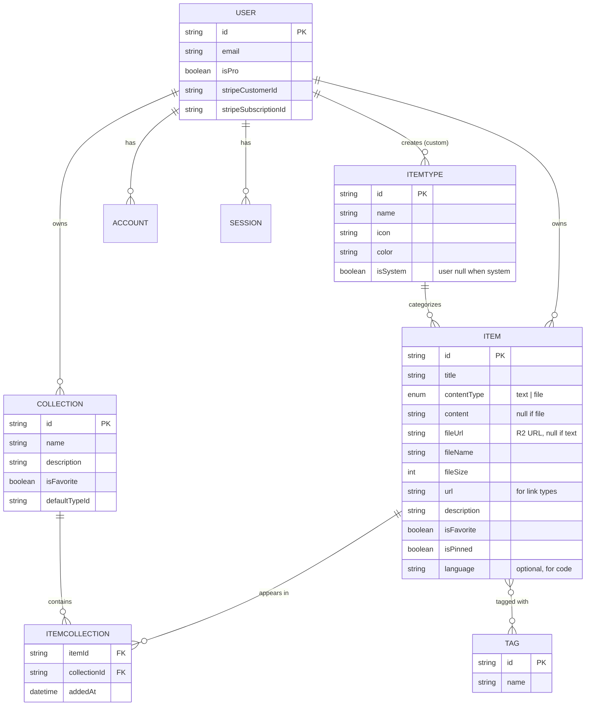
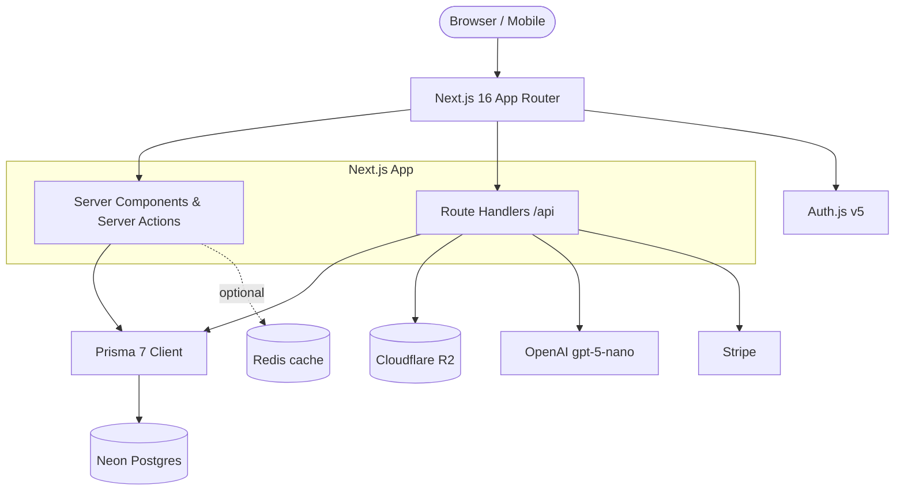

# DevStash — Project Overview

> **One fast, searchable, AI-enhanced hub for everything a developer keeps scattered** — snippets, prompts, commands, links, notes, and files.

**Status:** Planning / pre-build · **Doc type:** Living spec · **Last reviewed:** 2026-06-16

---

## Table of Contents

1. [The Problem](#the-problem)
2. [Target Users](#target-users)
3. [Features](#features)
4. [Item Types — Icon & Color Reference](#item-types--icon--color-reference)
5. [Routing & URL Structure](#routing--url-structure)
6. [Data Model](#data-model)
7. [Prisma Schema (Rough Draft)](#prisma-schema-rough-draft)
8. [Tech Stack](#tech-stack)
9. [Architecture](#architecture)
10. [Monetization](#monetization)
11. [UI / UX Guidelines](#ui--ux-guidelines)
12. [Build Notes & Gotchas](#build-notes--gotchas)
13. [Open Questions](#open-questions)
14. [Resources & Docs](#resources--docs)

---

## The Problem

Developers keep their essentials scattered across too many places:

- Code snippets in VS Code or Notion
- AI prompts in chat histories
- Context files buried in projects
- Useful links in bookmarks
- Docs in random folders
- Commands in `.txt` files or bash history
- Project templates in GitHub gists

The result is constant context switching, lost knowledge, and inconsistent workflows. **DevStash** consolidates all of it into a single hub that is fast to search and quick to add to.

---

## Target Users

| Persona | What they need from DevStash |
| --- | --- |
| **Everyday Developer** | A fast way to grab snippets, prompts, commands, and links |
| **AI-first Developer** | A home for prompts, contexts, workflows, and system messages |
| **Content Creator / Educator** | Storage for code blocks, explanations, and course notes |
| **Full-stack Builder** | A library of patterns, boilerplates, and API examples |

---

## Features

### A. Items & Item Types
- Items have a **type**. Users can create custom types later; we ship with fixed **system types** (non-editable):
  `snippet`, `prompt`, `note`, `command`, `link`, plus `file` and `image` (Pro only).
- Each type maps to a content kind: **text** (snippet, note, prompt, command), **url** (link), or **file** (file, image).
- Items are quick to create and open via a **drawer** (no full page navigation needed).

### B. Collections
- Users create collections that hold items of **any type**.
- An item can belong to **multiple collections** (e.g. a React snippet in both *React Patterns* and *Interview Prep*).
- Examples: *React Patterns* (snippets, notes), *Context Files* (files), *Python Snippets* (snippets).

### C. Search
Powerful search across **content, tags, titles, and types**.

### D. Authentication
Email/password **or** GitHub sign-in.

### E. Other Features
- Favorites for collections and items
- Pin items to the top
- Recently used
- Import code from a file
- Markdown editor for text types
- File upload for file types (`file` / `image`)
- Export data in multiple formats
- Dark mode (default for devs), light mode optional
- Add/remove items to/from multiple collections
- View which collections an item belongs to

### F. AI Features (Pro only)
- AI auto-tag suggestions
- AI summaries
- "Explain this code"
- Prompt optimizer

---

## Item Types — Icon & Color Reference

Icons are [lucide-react](https://lucide.dev/icons/) names. Colors are used for card backgrounds (collections) and card borders (items).

| Type | Route | Icon (lucide) | Color | Content kind | Tier |
| --- | --- | --- | --- | --- | --- |
| Snippet | `/items/snippets` | `Code` | `#3b82f6` (blue) | text | Free |
| Prompt | `/items/prompts` | `Sparkles` | `#8b5cf6` (purple) | text | Free |
| Command | `/items/commands` | `Terminal` | `#f97316` (orange) | text | Free |
| Note | `/items/notes` | `StickyNote` | `#fde047` (yellow) | text | Free |
| Link | `/items/links` | `Link` | `#10b981` (emerald) | url | Free |
| File | `/items/files` | `File` | `#6b7280` (gray) | file | **Pro** |
| Image | `/items/images` | `Image` | `#ec4899` (pink) | file | **Pro** |

---

## Routing & URL Structure

Type listings follow `/items/{type}` (e.g. `/items/snippets`).

```
/                         → Dashboard (collection grid + recents)
/items/[type]             → Items of a given type (snippets, prompts, …)
/items/[id]               → Item detail (opens in drawer; deep-linkable)
/collections              → All collections
/collections/[id]         → Single collection
/search?q=…               → Search results
/settings                 → Account, theme, billing
/login                    → Email/password + GitHub
/api/…                    → Route handlers (items, uploads, AI, Stripe webhooks)
```

---

## Data Model

> This is a **rough mockup** of the data shape — *not set in stone*.



Notes:
- **Item ↔ Collection** is a many-to-many via the explicit `ITEMCOLLECTION` join table, which also tracks `addedAt`.
- **Item ↔ Tag** is many-to-many (modeled implicitly in the draft below).
- `ITEMTYPE.user` is `null` for system types and set for user-created custom types.

---

## Prisma Schema (Rough Draft)

> ⚠️ **ROUGH DRAFT — validate before generating any migration.** Targets **Prisma 7** (new Rust-free `prisma-client` provider). See [Build Notes](#build-notes--gotchas) for v7-specific config requirements.

```prisma
// schema.prisma — DRAFT

generator client {
  provider = "prisma-client"          // Prisma 7 (replaces prisma-client-js)
  output   = "../src/generated/prisma" // `output` is required in v7
}

datasource db {
  provider = "postgresql"
  url      = env("DATABASE_URL")       // Neon connection string
}

// ---------- Enums ----------
enum ContentType {
  text
  file
}

// ---------- Auth (NextAuth / Auth.js v5) ----------
model User {
  id                   String    @id @default(cuid())
  name                 String?
  email                String    @unique
  emailVerified        DateTime?
  image                String?
  passwordHash         String?   // email/password (credentials) sign-in
  isPro                Boolean   @default(false)
  stripeCustomerId     String?   @unique
  stripeSubscriptionId String?   @unique

  accounts    Account[]
  sessions    Session[]
  items       Item[]
  itemTypes   ItemType[]   // custom (user-created) types
  collections Collection[]

  createdAt DateTime @default(now())
  updatedAt DateTime @updatedAt
}

model Account {
  id                String  @id @default(cuid())
  userId            String
  type              String
  provider          String
  providerAccountId String
  refresh_token     String?
  access_token      String?
  expires_at        Int?
  token_type        String?
  scope             String?
  id_token          String?
  session_state     String?

  user User @relation(fields: [userId], references: [id], onDelete: Cascade)

  @@unique([provider, providerAccountId])
}

model Session {
  id           String   @id @default(cuid())
  sessionToken String   @unique
  userId       String
  expires      DateTime
  user         User     @relation(fields: [userId], references: [id], onDelete: Cascade)
}

model VerificationToken {
  identifier String
  token      String
  expires    DateTime

  @@unique([identifier, token])
}

// ---------- Core ----------
model Item {
  id          String      @id @default(cuid())
  title       String
  contentType ContentType @default(text)
  content     String?     // text content (null when file)
  fileUrl     String?     // Cloudflare R2 URL (null when text)
  fileName    String?
  fileSize    Int?        // bytes
  url         String?     // for link type
  description String?
  language    String?     // optional, for syntax highlighting
  isFavorite  Boolean     @default(false)
  isPinned    Boolean     @default(false)

  userId String
  user   User   @relation(fields: [userId], references: [id], onDelete: Cascade)

  itemTypeId String
  itemType   ItemType @relation(fields: [itemTypeId], references: [id])

  tags        Tag[]            // implicit many-to-many
  collections ItemCollection[] // explicit join (tracks addedAt)

  createdAt DateTime @default(now())
  updatedAt DateTime @updatedAt

  @@index([userId])
  @@index([itemTypeId])
}

model ItemType {
  id       String  @id @default(cuid())
  name     String
  icon     String  // lucide icon name, e.g. "Code"
  color    String  // hex, e.g. "#3b82f6"
  isSystem Boolean @default(false)

  userId String? // null for system types
  user   User?   @relation(fields: [userId], references: [id], onDelete: Cascade)

  items Item[]

  @@unique([userId, name])
}

model Collection {
  id            String  @id @default(cuid())
  name          String
  description   String?
  isFavorite    Boolean @default(false)
  defaultTypeId String? // type used for new items when collection is empty

  userId String
  user   User   @relation(fields: [userId], references: [id], onDelete: Cascade)

  items ItemCollection[]

  createdAt DateTime @default(now())
  updatedAt DateTime @updatedAt

  @@index([userId])
}

model ItemCollection {
  itemId       String
  collectionId String
  addedAt      DateTime @default(now())

  item       Item       @relation(fields: [itemId], references: [id], onDelete: Cascade)
  collection Collection @relation(fields: [collectionId], references: [id], onDelete: Cascade)

  @@id([itemId, collectionId])
  @@index([collectionId])
}

model Tag {
  id    String @id @default(cuid())
  name  String @unique // see Open Questions: global vs per-user scope
  items Item[]         // implicit many-to-many
}
```

---

## Tech Stack

| Layer | Choice | Version (current, Jun 2026) | Notes |
| --- | --- | --- | --- |
| Framework | Next.js + React | Next 16.x · React 19.2 | App Router, SSR + dynamic components, one repo |
| Language | TypeScript | 5.x | Type safety end-to-end |
| Database | Neon PostgreSQL | — | Serverless Postgres in the cloud |
| ORM | Prisma | 7.x | Rust-free `prisma-client`; **migrations only** |
| Cache | Redis | — | *Optional / "maybe"* — decide if needed |
| File storage | Cloudflare R2 | — | File & image uploads (Pro) |
| Auth | Auth.js (NextAuth) v5 | 5.x | Email/password + GitHub OAuth |
| AI | OpenAI `gpt-5-nano` | — | ~$0.05/M in, $0.40/M out, 400K ctx |
| Styling | Tailwind CSS v4 + shadcn/ui | 4.x | Plus syntax highlighting for code |
| Payments | Stripe | — | Subscriptions ($8/mo, $72/yr) |

> A newer `gpt-5.4-nano` also exists (adds vision, ~$0.20/M in, $1.25/M out) if you want to revisit the AI model choice later.

---

## Architecture



---

## Monetization

Freemium. **During development, all users get everything** — but build the gates in from day one so flipping Pro on is trivial.

| | Free | Pro — $8/mo or $72/yr |
| --- | --- | --- |
| Items | 50 total | Unlimited |
| Collections | 3 | Unlimited |
| System types | All except `file` / `image` | All |
| File & image uploads | ❌ | ✅ |
| Custom types | ❌ | ✅ *(ships later)* |
| Search | Basic | Basic |
| AI auto-tagging | ❌ | ✅ |
| AI code explanation | ❌ | ✅ |
| AI prompt optimizer | ❌ | ✅ |
| Export (JSON / ZIP) | ❌ | ✅ |
| Support | Standard | Priority |

---

## UI / UX Guidelines

**General**
- Modern, minimal, developer-focused
- Dark mode by default; light mode optional
- Clean typography, generous whitespace, subtle borders and shadows
- Syntax highlighting for code blocks
- References: **Notion, Linear, Raycast**

**Layout**
- Sidebar + main content, **collapsible sidebar**
- *Sidebar:* item types linking to their listings (Snippets, Commands, …) + latest collections
- *Main:* grid of **color-coded collection cards** (background color = the type they hold most of). Items shown as cards with a **color-coded border** by type.
- Individual items open in a **quick-access drawer**

**Responsive**
- Desktop-first but mobile usable
- Sidebar becomes a drawer on mobile

**Micro-interactions**
- Smooth transitions, card hover states
- Toast notifications for actions
- Loading skeletons

---

## Build Notes & Gotchas

These reflect the **current** state of the chosen versions and will save real debugging time.

**Migrations only — never `db push`.** Always create migrations, run them in dev, then promote to prod. This pairs with Prisma 7's config changes below.

**Prisma 7 specifics:**
- Use the new `prisma-client` provider (not `prisma-client-js`); the `output` field is now **required** in the generator block.
- Configuration moved to a `prisma.config.ts` file at the project root (database URL, schema location, migration output, seed scripts).
- The CLI **no longer auto-loads `.env`** — load env vars explicitly (e.g. via `dotenv`) when invoking Prisma commands. (Bun loads `.env` automatically.)
- Prisma 7 ships a new `npx prisma studio`.

**Next.js 16 specifics:**
- Turbopack is the default bundler; React Compiler support is stable.
- Caching is now **opt-in** via the `use cache` directive / Cache Components — no more implicit App Router caching surprises.
- `middleware.ts` has been **renamed to `proxy.ts`**.

**Auth.js v5 specifics:**
- Env prefix is `AUTH_*` (e.g. `AUTH_GITHUB_ID`, `AUTH_GITHUB_SECRET`), not the old `NEXTAUTH_*`.
- Unified `auth()` function replaces `getServerSession` and the middleware helper.
- **Credentials (email/password) requires `session: { strategy: "jwt" }`** — the database-session strategy does not work with the credentials provider, even with the Prisma adapter.
- Do **not** rely on middleware/proxy-only route protection for security (cf. CVE-2025-29927) — verify sessions in the data layer / server actions too.
- Ecosystem note: Auth.js maintainers now steer *new* projects toward **Better Auth**. Auth.js v5 is still solid; just a decision worth making consciously up front.

---

## Open Questions

1. **Redis** — keep it or drop it? Listed as "maybe." Add only if a real caching need appears.
2. **`contentType` vs link type** — the enum is `text | file`, but links are a third "url" kind. Decide: add `url` to the enum, or treat links as `text` with `url` populated. (Draft currently does the latter.)
3. **Tag scope** — global or per-user? `TAG.name` is `@unique` in the draft (global). Per-user tags would need `@@unique([userId, name])` and a `userId` field.
4. **`defaultTypeId`** — formalize as a relation to `ItemType`, or keep as a loose string?
5. **Upload limits** — max file size and allowed MIME types for R2 uploads (Pro).
6. **Export formats** — JSON and ZIP are specified for Pro; confirm scope (full account vs per-collection).
7. **Custom types** — explicitly "comes later"; confirm it stays out of v1.

---

## Resources & Docs

- **Next.js 16** — https://nextjs.org/docs · upgrade: https://nextjs.org/docs/app/guides/upgrading/version-16
- **React 19** — https://react.dev
- **Prisma 7** — https://www.prisma.io/docs · v7 upgrade: https://www.prisma.io/docs/guides/upgrade-prisma-orm/v7
- **Neon Postgres** — https://neon.com/docs
- **Auth.js v5** — https://authjs.dev · migrating to v5: https://authjs.dev/getting-started/migrating-to-v5
- **Cloudflare R2** — https://developers.cloudflare.com/r2/
- **OpenAI API** — https://platform.openai.com/docs
- **Tailwind CSS v4** — https://tailwindcss.com/docs
- **shadcn/ui** — https://ui.shadcn.com
- **lucide icons** — https://lucide.dev/icons/
- **Stripe** — https://docs.stripe.com